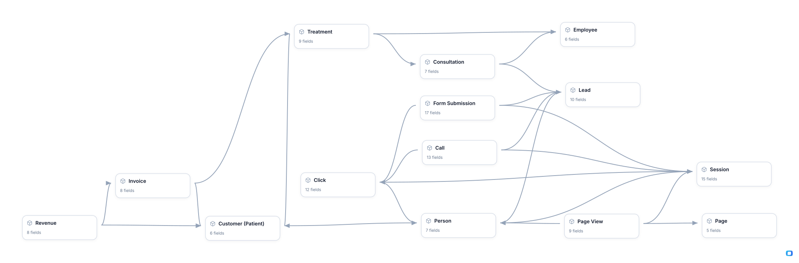

<!-- OWOX:GENERATED:START — regenerated on export, do not edit inside this block -->

**Authors:** [Lesley van de Mortel](https://www.linkedin.com/in/lezvandemortel/), [Vlad Flaks](https://github.com/vladflaks)

| Data Mart | Fields | Description |
|-----------|--------|-------------|
| [Call](./call.md) | 13 | Every telephone conversation between the practice and someone enquiring. |
| [Click](./click.md) | 12 | Every click on one of the practice's ads, held as its own record rather than as columns on whatever happened next, and keyed the same way on every platform so clicks across Google, Meta, Microsoft and TikTok count in one place. |
| [Consultation](./consultation.md) | 7 | Where an enquiry is judged. |
| [Customer (Patient)](./customer-patient.md) | 6 | The patient once money is involved. |
| [Employee](./employee.md) | 6 | Everyone at the practice who takes part in turning an enquiry into a booked treatment — clinicians, receptionists and practice managers alike — kept as one list and told apart by `type`: `Doctor`, `Receptionist`, `Manager`. |
| [Form Submission](./form-submission.md) | 17 | Every web form the practice receives, with the advertising that produced it attached. |
| [Invoice](./invoice.md) | 8 | A bill the practice has issued, raised against one treatment and one patient. |
| [Lead](./lead.md) | 10 | The enquiry as the practice's CRM holds it: a named person with contact details, created the moment someone first gets in touch, by web form or by phone. |
| [Page](./page.md) | 5 | Every page of the practice's website that a visitor can land on, held once and reused by every view of it. |
| [Page View](./page-view.md) | 9 | Every page a visitor actually opened, in the order they opened it. |
| [Person](./person.md) | 7 | The human behind everything else in this model. |
| [Revenue](./revenue.md) | 8 | Money the practice has actually received. |
| [Session](./session.md) | 15 | One visit to the practice's website, from the moment someone arrives to the moment they go quiet; everything seen or clicked in between belongs to it. |
| [Treatment](./treatment.md) | 9 | The step between a clinician saying yes and the practice being paid. |

# Example Questions

- Which `pages` and which creatives bring the enquiries a clinician goes on to qualify, rather than the ones that bring `clicks` and stop there?
- Which advertising brings enquiries that look right all the way to the `consultation` and are then refused by the clinician, and what reason is recorded for the refusal?
- How long does money take to arrive once a `treatment` is booked, split between the copay the patient pays before treatment and the insurer's reimbursement afterwards?

# Explore this model

**[▶ Explore on canvas](https://model.owox.com/?okf=https://github.com/OWOX/models/tree/main/bundles/healthcare-clinic-attribution)**

One click opens this model in a free OWOX canvas you can poke around in — no account needed.

<!-- OWOX:GENERATED:END -->

## Model preview

