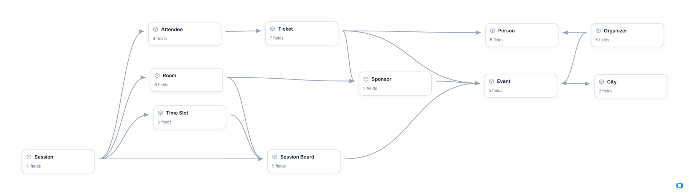

# MeasureCamp

**Authors:** [Vlad Flaks](https://www.linkedin.com/in/vladflaks), [Peter O’Neill](https://www.linkedin.com/in/peteroneill)

| Data Mart | Fields |
|-----------|--------|
| [Attendee](./attendee.md) | 4 |
| [City](./city.md) | 2 |
| [Event](./event.md) | 5 |
| [Organizer](./organizer.md) | 5 |
| [Person](./person.md) | 5 |
| [Room](./room.md) | 6 |
| [Session](./session.md) | 11 |
| [Session Board](./session-board.md) | 5 |
| [Sponsor](./sponsor.md) | 5 |
| [Ticket](./ticket.md) | 7 |
| [Time Slot](./time-slot.md) | 6 |

# Example Questions

- How full did each board get — of the `rooms` times session slots a `session board` offered, how many carried an actual `session`, and which editions left the most space unused?
- Was the programme varied or lopsided — how did an edition's `sessions` spread across level, type and audience, and did any board end up with nothing for beginners?
- How far is registering from attending — what share of `tickets` turned into `attendees`, how many of those were first-timers, and does the gap differ by `city`?

# Explore this model

**[▶ Explore on canvas](https://model.owox.com/?okf=https://github.com/OWOX/models/tree/main/bundles/measurecamp)**

One click opens this model in a free OWOX canvas you can poke around in — no account needed.

## Model preview

---

_Generated with [OWOX Data Marts](https://www.owox.com/) · [Model Canvas](https://model.owox.com/) · [open source](https://github.com/OWOX/models)_
