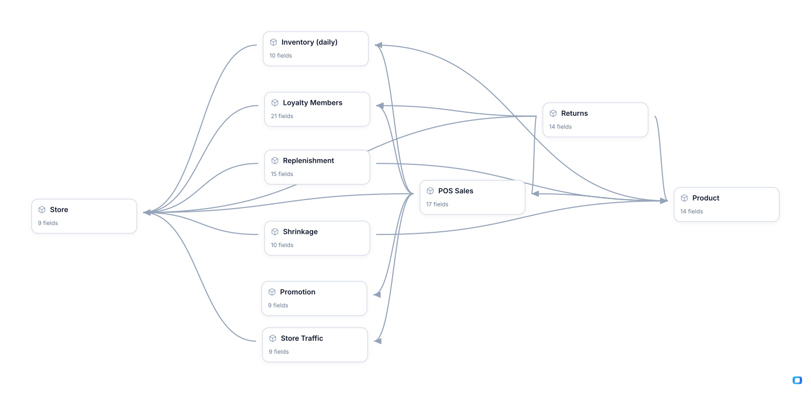

<!-- OWOX:GENERATED:START — regenerated on export, do not edit inside this block -->

**Authors:** [Vlad Flaks](https://github.com/vladflaks), [Rus Obolonsky](https://github.com/Obolrus)

| Data Mart | Fields |
|-----------|--------|
| [Inventory (daily)](./inventory-daily.md) | 10 |
| [Loyalty Members](./loyalty-members.md) | 21 |
| [POS Sales](./pos-sales.md) | 17 |
| [Product](./product.md) | 14 |
| [Promotion](./promotion.md) | 9 |
| [Replenishment](./replenishment.md) | 15 |
| [Returns](./returns.md) | 14 |
| [Shrinkage](./shrinkage.md) | 10 |
| [Store](./store.md) | 9 |
| [Store Traffic](./store-traffic.md) | 9 |

# Example Questions

- When a `store`'s sales fall, which lever moved — did fewer people come in, did fewer of them buy, did they spend less per basket, or did the lines they came for finish the day out of stock?
- Which `promotions` earned their discount and which merely bought volume we already had, judged on line-level margin rather than revenue, and does the answer change by funding source?
- What does the reverse flow really cost — refunds plus the value destroyed by disposition, plus the shrink that never reaches a till at all — and where do the two concentrate by `store`, by category and by the way each loss was detected?

# Explore this model

**[▶ Explore on canvas](https://model.owox.com/?okf=https://github.com/OWOX/models/tree/main/bundles/retail-chain)**

One click opens this model in a free OWOX canvas you can poke around in — no account needed.

<!-- OWOX:GENERATED:END -->

## Model preview

