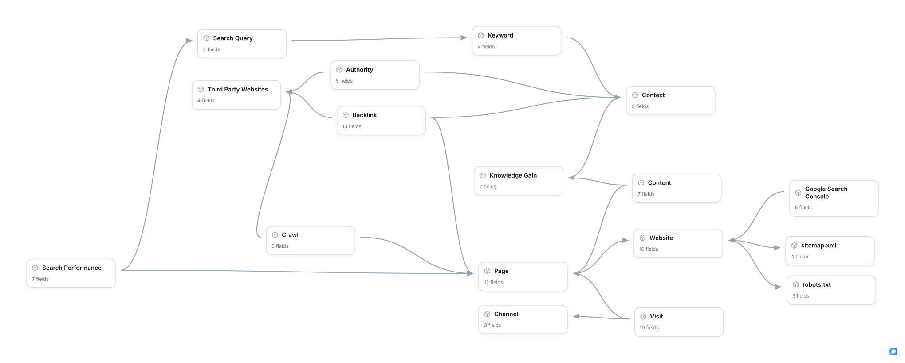

<!-- OWOX:GENERATED:START — regenerated on export, do not edit inside this block -->

**Authors:** [Max Roslyakov](https://www.linkedin.com/in/xamsor/), [Vlad Flaks](https://github.com/vladflaks)

| Data Mart | Fields | Description |
|-----------|--------|-------------|
| [Authority](./authority.md) | 5 | How much standing one external site carries in one topic, on one day. |
| [Backlink](./backlink.md) | 10 | One placement of a brand on somebody else's site: a link back to one of its pages, or the brand named in their text without one. |
| [Channel](./channel.md) | 3 | How a visitor arrived, as an analytics tool classifies it: organic search, a referral from another site, direct entry, or an AI assistant. |
| [Content](./content.md) | 7 | The text, images and video a site publishes: the first of the three pillars of search — what a business says about itself, and the material that gets indexed and served in AI answers and in Google. |
| [Context](./context.md) | 2 | The topic a search belongs to — the subject someone is asking about, rather than the words they used to ask. |
| [Crawl](./crawl.md) | 8 | One fetch of one page by one robot. |
| [Google Search Console](./google-search-console.md) | 5 | The property registered with Google: Google's own facility where a site is entered directly, as a claim of ownership and a request that it be crawled — and Google goes and crawls it. |
| [Initiate Index](./initiate-index.md) | 4 | The moment a site or one of its pages enters the queue to be indexed. |
| [Keyword](./keyword.md) | 4 | A term the practice targets — the middle of the three levels this model keeps for demand. |
| [Knowledge Gain](./knowledge-gain.md) | 7 | Whether a piece of content brings new knowledge into a topic — a super-important component of ranking. |
| [Page](./page.md) | 12 | One page of the site being optimised: the unit that gets crawled, indexed, ranked and arrived at. |
| [Search Performance](./search-performance.md) | 7 | Where one page stood for one query on one day, and what that standing earned. |
| [Search Query](./search-query.md) | 4 | What somebody actually put into a search box. |
| [Third Party Websites](./third-party-websites.md) | 4 | The sites a practice does not own: the hosts that link to it, mention it, or could. |
| [Visit](./visit.md) | 10 | Somebody — or something — arriving on one of a site's pages. |
| [Website](./website.md) | 10 | The site being optimised — the object the whole technical side of search work is done to, and the boundary between what is within a practice's control and what is not. |
| [robots.txt](./robots-txt.md) | 5 | The file a site publishes to tell arriving search robots where they may go and where they may not, and which of them the owner wants indexed at all. |
| [sitemap.xml](./sitemap-xml.md) | 4 | The structured list of its own pages a site hands to search engines for indexing. |

# Example Questions

- Which `queries` have we come from nowhere into the top 20 for, which of those have gone on into the first five lines, and how long did each step take us?
- For a topic we are trying to enter, which of the sites we pay to appear on carry standing in that topic rather than standing in general, and what have those placements cost us once the articles we had to write for them are counted?
- Which of our `pages` hold positions and still earn nothing, what does the `content` on them add to its topic, and what are they doing to the averages the rest of the site is read by?

# Explore this model

**[▶ Explore on canvas](https://model.owox.com/?okf=https://github.com/OWOX/models/tree/main/bundles/seo)**

One click opens this model in a free OWOX canvas you can poke around in — no account needed.

<!-- OWOX:GENERATED:END -->

## Model preview

